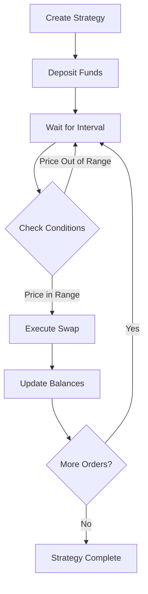

# DCA Strategies

Dollar-Cost Averaging (DCA) on IOTA DeFi allows you to automate your investment strategy, reducing the impact of volatility while building positions over time.

## What is DCA?

Dollar-Cost Averaging is an investment strategy where you:

- **Buy Regularly**: Purchase fixed amounts at set intervals
- **Reduce Timing Risk**: Avoid trying to time the market
- **Average Your Cost**: Smooth out price volatility
- **Automate Investing**: Set it and forget it

<div style={{
  background: 'linear-gradient(135deg, rgba(0, 255, 255, 0.1) 0%, rgba(0, 128, 255, 0.1) 100%)',
  border: '1px solid rgba(0, 255, 255, 0.3)',
  borderRadius: '12px',
  padding: '24px',
  marginTop: '24px',
  marginBottom: '24px'
}}>
  <h3 style={{ marginTop: 0, color: '#00ffff' }}>DCA Benefits</h3>
  
  ✅ **Emotional Discipline**: Removes emotional decision-making
  
  ✅ **Risk Management**: Spreads purchases over time
  
  ✅ **Accessibility**: Start with any amount
  
  ✅ **Flexibility**: Adjust or stop anytime
</div>

## How DCA Works on IOTA DeFi

### Automated Execution

Our smart contracts handle everything:

1. **Schedule Orders**: Daily, weekly, or monthly
2. **Execute Swaps**: At your chosen intervals
3. **Price Limits**: Optional min/max price bounds
4. **Gas Optimization**: Batched transactions when possible

### DCA Flow



## Creating a DCA Strategy

### Basic Setup

<div style={{
  background: 'rgba(10, 10, 10, 0.8)',
  border: '1px solid rgba(255, 255, 255, 0.1)',
  borderRadius: '8px',
  padding: '20px',
  marginTop: '16px',
  marginBottom: '16px'
}}>
  <h4 style={{ marginTop: 0, color: '#00ffff' }}>Strategy Parameters</h4>
  
  ```typescript
  {
    sourceToken: 'USDC',           // Token to spend
    targetToken: 'IOTA',           // Token to buy
    amountPerOrder: '100',         // Amount each interval
    interval: 'daily',             // Frequency
    totalOrders: 30,               // Number of purchases
    minPrice: '8.00',             // Optional: min price
    maxPrice: '12.00'             // Optional: max price
  }
  ```
</div>

### Step-by-Step Guide

1. **Select Tokens**
   - Choose source token (what you're spending)
   - Choose target token (what you're buying)

2. **Set Schedule**
   - Amount per purchase
   - Frequency (hourly, daily, weekly, monthly)
   - Total number of orders

3. **Configure Limits** (Optional)
   - Minimum acceptable price
   - Maximum acceptable price
   - Price source oracle

4. **Fund Strategy**
   - Deposit total amount needed
   - Approve token spending
   - Activate strategy

## DCA Examples

### Example 1: Weekly Bitcoin Accumulation

<div style={{
  background: 'rgba(10, 10, 10, 0.8)',
  border: '1px solid rgba(0, 255, 255, 0.2)',
  borderRadius: '8px',
  padding: '16px',
  marginTop: '16px',
  marginBottom: '16px'
}}>
  <strong>Goal:</strong> Accumulate $1,000 of BTC over 10 weeks
  
  ```
  Source Token: USDC
  Target Token: WBTC
  Amount per Order: $100
  Interval: Weekly (Mondays at 12:00 UTC)
  Total Orders: 10
  Price Limits: None (buy at any price)
  ```
  
  **Result**: After 10 weeks, you'll have accumulated BTC at the average price over that period
</div>

### Example 2: Daily ETH with Price Bounds

<div style={{
  background: 'rgba(10, 10, 10, 0.8)',
  border: '1px solid rgba(0, 255, 255, 0.2)',
  borderRadius: '8px',
  padding: '16px',
  marginTop: '16px',
  marginBottom: '16px'
}}>
  <strong>Goal:</strong> Buy ETH daily, but only when price is favorable
  
  ```
  Source Token: USDC
  Target Token: WETH
  Amount per Order: $50
  Interval: Daily (00:00 UTC)
  Total Orders: 365
  Min Price: $1,500 (skip if below)
  Max Price: $2,000 (skip if above)
  ```
  
  **Result**: Accumulates ETH only when price is in your target range
</div>

### Example 3: Micro DCA Strategy

<div style={{
  background: 'rgba(10, 10, 10, 0.8)',
  border: '1px solid rgba(0, 255, 255, 0.2)',
  borderRadius: '8px',
  padding: '16px',
  marginTop: '16px',
  marginBottom: '16px'
}}>
  <strong>Goal:</strong> Extreme averaging with hourly purchases
  
  ```
  Source Token: IOTA
  Target Token: stIOTA
  Amount per Order: 10 IOTA
  Interval: Hourly
  Total Orders: 168 (1 week)
  Price Limits: None
  ```
  
  **Result**: Captures intraday volatility with 168 small purchases
</div>

## Managing Active Strategies

### Strategy Dashboard

Monitor your DCA strategies with:

- **Progress Bar**: Orders completed vs remaining
- **Average Price**: Your cost basis so far
- **Total Accumulated**: Amount of target token acquired
- **Next Execution**: Countdown timer
- **Performance**: Compare to lump sum purchase

### Modifying Strategies

You can adjust active strategies:

<div style={{
  background: 'rgba(0, 255, 255, 0.1)',
  border: '1px solid rgba(0, 255, 255, 0.3)',
  borderRadius: '8px',
  padding: '16px',
  marginTop: '16px',
  marginBottom: '16px'
}}>
  <strong>🔧 Modifiable Parameters:</strong>
  
  ✅ **Pause/Resume**: Temporarily stop execution
  
  ✅ **Cancel**: Stop and withdraw remaining funds
  
  ✅ **Extend**: Add more orders to existing strategy
  
  ❌ **Cannot Change**: Interval, amounts, or tokens
</div>

## Advanced Features

### Price-Weighted DCA

Automatically adjust purchase amounts based on price:

```typescript
// Buy more when price is lower
if (currentPrice < averagePrice * 0.95) {
  orderAmount = baseAmount * 1.5; // 50% more
} else if (currentPrice > averagePrice * 1.05) {
  orderAmount = baseAmount * 0.5; // 50% less
}
```

### Multi-Asset DCA

Diversify across multiple tokens:

<div style={{
  background: 'rgba(10, 10, 10, 0.8)',
  border: '1px solid rgba(255, 255, 255, 0.1)',
  borderRadius: '8px',
  padding: '20px',
  marginTop: '16px',
  marginBottom: '16px'
}}>
  <h4 style={{ marginTop: 0, color: '#00ffff' }}>Portfolio DCA Strategy</h4>
  
  Split $1000 monthly across:
  - 40% BTC ($400)
  - 30% ETH ($300)
  - 20% IOTA ($200)
  - 10% Others ($100)
  
  Each executes independently with own parameters
</div>

### Conditional DCA

Execute based on market conditions:

- **RSI-Based**: Buy only when RSI < 30
- **Moving Average**: Buy when price < 200 DMA
- **Volatility**: Increase buys during high volatility

## Fee Structure

### DCA Costs

- **Protocol Fee**: 0.1% per execution
- **Swap Fees**: Standard 0.3% AMM fee
- **Gas Costs**: Optimized batch transactions
- **No Setup Fee**: Free to create strategies

### Cost Example

```typescript
// Monthly DCA of $1000
Protocol Fee: $1 (0.1% of $1000)
Swap Fee: $3 (0.3% of $1000)
Gas Cost: ~$0.50 (IOTA network)
Total Cost: $4.50 per month (0.45%)
```

## Performance Analytics

### Track Your Results

<div style={{ display: 'grid', gridTemplateColumns: 'repeat(auto-fit, minmax(200px, 1fr))', gap: '16px', marginTop: '16px' }}>
  <div style={{
    background: 'rgba(10, 10, 10, 0.8)',
    border: '1px solid rgba(255, 255, 255, 0.1)',
    borderRadius: '8px',
    padding: '16px'
  }}>
    <h4 style={{ marginTop: 0, color: '#00ffff' }}>Average Cost</h4>
    <p>Your average purchase price</p>
  </div>
  
  <div style={{
    background: 'rgba(10, 10, 10, 0.8)',
    border: '1px solid rgba(255, 255, 255, 0.1)',
    borderRadius: '8px',
    padding: '16px'
  }}>
    <h4 style={{ marginTop: 0, color: '#00ffff' }}>Total Value</h4>
    <p>Current value of accumulated tokens</p>
  </div>
  
  <div style={{
    background: 'rgba(10, 10, 10, 0.8)',
    border: '1px solid rgba(255, 255, 255, 0.1)',
    borderRadius: '8px',
    padding: '16px'
  }}>
    <h4 style={{ marginTop: 0, color: '#00ffff' }}>Profit/Loss</h4>
    <p>Unrealized gains or losses</p>
  </div>
  
  <div style={{
    background: 'rgba(10, 10, 10, 0.8)',
    border: '1px solid rgba(255, 255, 255, 0.1)',
    borderRadius: '8px',
    padding: '16px'
  }}>
    <h4 style={{ marginTop: 0, color: '#00ffff' }}>vs Lump Sum</h4>
    <p>Compare to buying all at once</p>
  </div>
</div>

### Historical Comparison

```typescript
// DCA Performance Calculator
const dcaResults = {
  totalInvested: 10000,
  tokensAcquired: 952.38,
  averagePrice: 10.50,
  currentValue: 11428.56,
  profit: 1428.56,
  profitPercent: 14.29
};

const lumpSumResults = {
  totalInvested: 10000,
  tokensAcquired: 1000,
  purchasePrice: 10.00,
  currentValue: 12000,
  profit: 2000,
  profitPercent: 20.00
};
```

## Smart Contract Architecture

### Security Features

```solidity
contract DCAStrategy {
    // User maintains control
    mapping(address => Strategy) public strategies;
    
    // Safety checks
    modifier onlyOwner(uint256 strategyId) {
        require(msg.sender == strategies[strategyId].owner);
        _;
    }
    
    // Transparent execution
    event OrderExecuted(
        uint256 strategyId,
        uint256 amountIn,
        uint256 amountOut,
        uint256 executionPrice
    );
}
```

## API Integration

### Create DCA Programmatically

```typescript
import { DCAClient } from '@iota-defi/sdk';

const client = new DCAClient({ network: 'mainnet' });

// Create strategy
const strategy = await client.createStrategy({
  sourceToken: 'USDC',
  targetToken: 'IOTA',
  amountPerOrder: '100',
  interval: 86400, // 1 day in seconds
  totalOrders: 30,
  minPrice: '8.00',
  maxPrice: '12.00'
});

// Monitor progress
const status = await client.getStrategyStatus(strategy.id);
console.log(`Progress: ${status.executedOrders}/${status.totalOrders}`);

// Pause strategy
await client.pauseStrategy(strategy.id);

// Resume strategy
await client.resumeStrategy(strategy.id);
```

## Best Practices

<div style={{
  background: 'rgba(255, 193, 7, 0.1)',
  border: '1px solid rgba(255, 193, 7, 0.3)',
  borderRadius: '8px',
  padding: '16px',
  marginTop: '16px',
  marginBottom: '16px'
}}>
  <strong>💰 DCA Success Tips:</strong>
  
  1. **Start Small**: Test with smaller amounts first
  2. **Long-Term Focus**: DCA works best over months/years
  3. **Ignore Volatility**: Stick to your plan
  4. **Regular Review**: Adjust strategy quarterly
  5. **Emergency Fund**: Don't DCA money you might need
  6. **Diversify**: Consider multiple assets
</div>

## Common Strategies

### Bear Market Accumulation

Increase DCA during downturns:

- Double amounts when price drops 20%
- Triple when down 40%
- Accumulate quality assets cheaply

### Bull Market Distribution

Reverse DCA to take profits:

- Sell fixed amounts regularly
- Lock in gains systematically
- Reduce position without timing top

## FAQs

**Q: What happens if I run out of funds?**
A: The strategy automatically completes. You can add more funds to extend it.

**Q: Can I withdraw unused funds?**
A: Yes, cancel the strategy to withdraw remaining balance immediately.

**Q: What if a swap fails?**
A: Failed swaps are retried next interval. No funds are lost.

**Q: Are there minimum amounts?**
A: Minimum $10 per order to cover fees efficiently.

## Next Steps

- [Create your first DCA strategy →](https://app.iota-defi.com/dca)
- [Learn about pools →](/core-features/pools)
- [Explore limit orders →](/core-features/limit-orders)
- [Read DCA smart contracts →](/smart-contracts/dca)