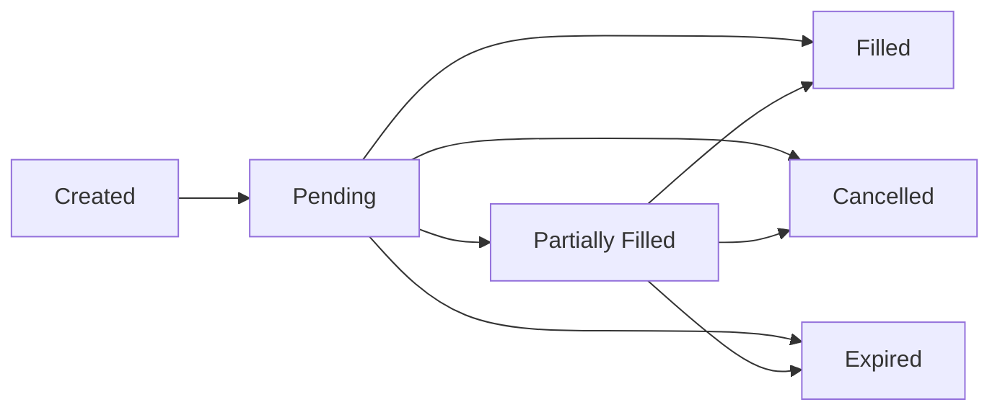

# Limit Orders

Take control of your trades with IOTA DeFi's advanced limit order system. Set your price and let the protocol execute automatically.

## What are Limit Orders?

Limit orders allow you to:

- **Set Exact Prices**: Buy or sell at your specified rate
- **Automate Trading**: Orders execute when conditions are met
- **Avoid Slippage**: Get exactly the price you want
- **Trade While Away**: No need to monitor markets 24/7

<div style={{
  background: 'linear-gradient(135deg, rgba(0, 255, 255, 0.1) 0%, rgba(0, 128, 255, 0.1) 100%)',
  border: '1px solid rgba(0, 255, 255, 0.3)',
  borderRadius: '12px',
  padding: '24px',
  marginTop: '24px',
  marginBottom: '24px'
}}>
  <h3 style={{ marginTop: 0, color: '#00ffff' }}>Limit vs Market Orders</h3>
  
  **Market Orders**: Execute immediately at current price
  
  **Limit Orders**: Execute only at your specified price or better
</div>

## How Limit Orders Work

### Order Types

<div style={{ display: 'grid', gridTemplateColumns: 'repeat(auto-fit, minmax(250px, 1fr))', gap: '16px', marginTop: '16px' }}>
  <div style={{
    background: 'rgba(10, 10, 10, 0.8)',
    border: '1px solid rgba(255, 255, 255, 0.1)',
    borderRadius: '8px',
    padding: '20px'
  }}>
    <h4 style={{ marginTop: 0, color: '#00ff00' }}>Buy Orders</h4>
    <p>Purchase tokens when price falls to or below your target</p>
    <code>If IOTA ≤ $10, buy 100 IOTA</code>
  </div>
  
  <div style={{
    background: 'rgba(10, 10, 10, 0.8)',
    border: '1px solid rgba(255, 255, 255, 0.1)',
    borderRadius: '8px',
    padding: '20px'
  }}>
    <h4 style={{ marginTop: 0, color: '#ff0000' }}>Sell Orders</h4>
    <p>Sell tokens when price rises to or above your target</p>
    <code>If IOTA ≥ $15, sell 100 IOTA</code>
  </div>
</div>

### Order Execution

Orders execute through:

1. **On-chain Matching**: Smart contracts monitor prices
2. **Keeper Network**: Decentralized executors trigger orders
3. **MEV Protection**: Front-running prevention built-in
4. **Fair Ordering**: First-in-first-out execution

## Creating Limit Orders

### Basic Order Setup

```typescript
// Order parameters
{
  orderType: 'BUY' | 'SELL',
  tokenIn: 'USDC',
  tokenOut: 'IOTA',
  amountIn: '1000',
  limitPrice: '10.50',
  expiration: '7d' | '30d' | 'GTC'
}
```

### Step-by-Step Guide

1. **Select Order Type**: Choose Buy or Sell
2. **Choose Tokens**: Pick your trading pair
3. **Set Amount**: How much to trade
4. **Set Price**: Your target execution price
5. **Set Expiration**: When order cancels if unfilled
6. **Review & Confirm**: Check all details

<div style={{
  background: 'rgba(0, 255, 255, 0.1)',
  border: '1px solid rgba(0, 255, 255, 0.3)',
  borderRadius: '8px',
  padding: '16px',
  marginTop: '16px',
  marginBottom: '16px'
}}>
  <strong>💡 Pro Tip:</strong> Set prices slightly off round numbers (e.g., $10.01 instead of $10.00) for better fill probability
</div>

## Order Management

### Active Orders Dashboard

Monitor your orders with:

- **Status Tracking**: Pending, Partial, Filled, Cancelled
- **Fill Progress**: See how much has executed
- **Time Remaining**: Countdown to expiration
- **Edit/Cancel**: Modify or remove orders

### Order States



## Advanced Features

### Order Types

<div style={{
  background: 'rgba(10, 10, 10, 0.8)',
  border: '1px solid rgba(255, 255, 255, 0.1)',
  borderRadius: '8px',
  padding: '20px',
  marginTop: '16px',
  marginBottom: '16px'
}}>
  <h4 style={{ marginTop: 0, color: '#00ffff' }}>Good Till Cancelled (GTC)</h4>
  <p>Order remains active until filled or manually cancelled</p>
  
  <h4 style={{ color: '#00ffff' }}>Time-Based Expiration</h4>
  <p>Order expires after set duration: 1 day, 7 days, 30 days</p>
  
  <h4 style={{ color: '#00ffff' }}>Fill or Kill (FOK)</h4>
  <p>Coming soon: Must fill entirely immediately or cancel</p>
  
  <h4 style={{ color: '#00ffff' }}>Immediate or Cancel (IOC)</h4>
  <p>Coming soon: Fill what's possible immediately, cancel rest</p>
</div>

### Price Strategies

**Ladder Orders**: Multiple orders at different prices

```javascript
// Example: DCA into position
Order 1: Buy 100 IOTA at $9.50
Order 2: Buy 200 IOTA at $9.00
Order 3: Buy 300 IOTA at $8.50
```

**Range Orders**: Buy low, sell high automatically

```javascript
// Example: Range trading
Buy Order: 1000 USDC → IOTA at $9.00
Sell Order: 111 IOTA → USDC at $10.00
Profit: $110 (11% gain)
```

## Fees and Costs

### Fee Structure

- **Maker Fee**: 0.1% (you add liquidity)
- **Taker Fee**: 0.3% (you remove liquidity)
- **No Fee**: When your order adds to book
- **Gas Costs**: One-time creation fee

### Fee Examples

```typescript
// Buy Order Example
Amount: 1000 USDC
Price: $10 per IOTA
Tokens Received: 100 IOTA
Maker Fee: 1 USDC (0.1%)
Total Cost: 1001 USDC

// Sell Order Example  
Amount: 100 IOTA
Price: $11 per IOTA
USDC Received: 1100 USDC
Maker Fee: 0.1 IOTA (0.1%)
Net Received: 1098.9 USDC
```

## Order Book Visualization

### Understanding the Book

<div style={{
  background: 'rgba(10, 10, 10, 0.8)',
  border: '1px solid rgba(255, 255, 255, 0.1)',
  borderRadius: '8px',
  padding: '20px',
  marginTop: '16px',
  marginBottom: '16px',
  fontFamily: 'monospace'
}}>
  <div style={{ color: '#ff0000' }}>
    <strong>ASKS (Sell Orders)</strong><br/>
    $10.15 - 500 IOTA<br/>
    $10.10 - 250 IOTA<br/>
    $10.05 - 100 IOTA<br/>
  </div>
  <div style={{ margin: '10px 0', color: '#00ffff', fontSize: '18px' }}>
    <strong>Spread: $0.05</strong>
  </div>
  <div style={{ color: '#00ff00' }}>
    $10.00 - 150 IOTA<br/>
    $9.95 - 300 IOTA<br/>
    $9.90 - 600 IOTA<br/>
    <strong>BIDS (Buy Orders)</strong>
  </div>
</div>

### Market Depth

- **Liquidity Depth**: Total orders at each price level
- **Spread**: Difference between best bid and ask
- **Order Impact**: How your order affects the book

## Smart Contract Security

### Order Safety

All orders are:
- **Non-custodial**: Funds remain in your control
- **Cancelable**: Cancel anytime before execution
- **Transparent**: All orders visible on-chain
- **Immutable**: Terms cannot be changed by others

### Security Features

```solidity
// Order struct ensures safety
struct LimitOrder {
    address owner;        // Only owner can cancel
    uint256 amountIn;    // Locked amount
    uint256 limitPrice;  // Execution price
    uint256 expiration;  // Auto-cancel time
    bytes32 orderHash;   // Unique identifier
}
```

## API Integration

### Place Orders Programmatically

```typescript
import { LimitOrderSDK } from '@iota-defi/sdk';

const sdk = new LimitOrderSDK({ 
  network: 'mainnet',
  privateKey: process.env.PRIVATE_KEY 
});

// Create buy order
const buyOrder = await sdk.createOrder({
  type: 'BUY',
  tokenIn: 'USDC',
  tokenOut: 'IOTA',
  amountIn: '1000',
  limitPrice: '9.50',
  expiration: Math.floor(Date.now() / 1000) + 86400 * 7 // 7 days
});

// Monitor order status
const status = await sdk.getOrderStatus(buyOrder.orderId);
console.log(`Order ${status.state}: ${status.filledAmount}/${status.totalAmount}`);

// Cancel order
await sdk.cancelOrder(buyOrder.orderId);
```

### Webhook Notifications

```typescript
// Subscribe to order updates
sdk.subscribeToOrder(orderId, {
  onPartialFill: (event) => {
    console.log(`Filled ${event.amount} at ${event.price}`);
  },
  onComplete: (event) => {
    console.log(`Order completed! Total: ${event.totalFilled}`);
  },
  onCancelled: (event) => {
    console.log(`Order cancelled: ${event.reason}`);
  }
});
```

## Trading Strategies

### DCA Strategy

Dollar-cost average into positions:

<div style={{
  background: 'rgba(10, 10, 10, 0.8)',
  border: '1px solid rgba(255, 255, 255, 0.1)',
  borderRadius: '8px',
  padding: '16px',
  marginTop: '16px',
  marginBottom: '16px'
}}>
  <strong>Weekly BTC Accumulation:</strong>
  <ol style={{ marginBottom: 0 }}>
    <li>Set buy order for $100 of BTC every Monday</li>
    <li>Use limit price 2% below market</li>
    <li>Orders fill on dips throughout the week</li>
    <li>Unfilled orders expire Sunday night</li>
  </ol>
</div>

### Grid Trading

Profit from volatility:

```javascript
// Grid setup for IOTA/USDC
Base Price: $10.00
Grid Size: 10 orders
Grid Spacing: 2%

Buy Orders:           Sell Orders:
$9.80 - Buy 100      $10.20 - Sell 100
$9.60 - Buy 100      $10.40 - Sell 100
$9.40 - Buy 100      $10.60 - Sell 100
```

## Best Practices

<div style={{
  background: 'rgba(255, 193, 7, 0.1)',
  border: '1px solid rgba(255, 193, 7, 0.3)',
  borderRadius: '8px',
  padding: '16px',
  marginTop: '16px',
  marginBottom: '16px'
}}>
  <strong>📊 Limit Order Tips:</strong>
  
  1. **Start Small**: Test with small amounts first
  2. **Monitor Spreads**: Tight spreads = better fills
  3. **Use Expiration**: Don't leave stale orders
  4. **Check Gas**: Ensure enough for execution
  5. **Review Regularly**: Market conditions change
</div>

## Troubleshooting

### Why didn't my order fill?

- **Price Not Reached**: Market hasn't hit your limit
- **Insufficient Liquidity**: Not enough counter-orders
- **Gas Issues**: Keeper couldn't execute
- **Order Expired**: Time limit reached

### Order Stuck as Pending?

1. Check current market price
2. Verify order parameters
3. Ensure sufficient balance
4. Try cancelling and recreating

## Next Steps

- [Set up DCA strategies →](/core-features/dca)
- [Learn about pools →](/core-features/pools)
- [View order book API →](/api-reference/orderbook)
- [Read limit order contracts →](/smart-contracts/limit-order)