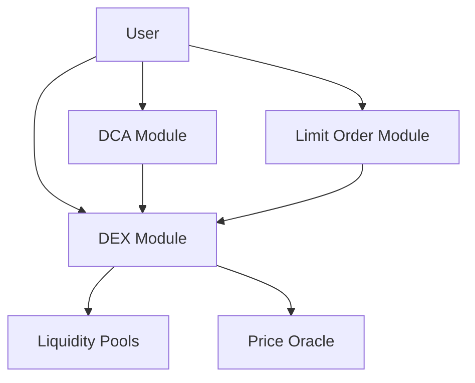

# Smart Contracts Overview

IOTA DeFi is built on Move, a secure and efficient smart contract language designed for digital assets. Our contracts prioritize safety, efficiency, and composability.

## Architecture

<div style={{
  background: 'linear-gradient(135deg, rgba(0, 255, 255, 0.1) 0%, rgba(0, 128, 255, 0.1) 100%)',
  border: '1px solid rgba(0, 255, 255, 0.3)',
  borderRadius: '12px',
  padding: '24px',
  marginTop: '24px',
  marginBottom: '24px'
}}>
  <h3 style={{ marginTop: 0, color: '#00ffff' }}>Core Modules</h3>
  
  - **DEX Module**: AMM swaps and liquidity pools
  - **Limit Order Module**: Order book functionality
  - **DCA Module**: Automated investment strategies
  - **Math Module**: Safe arithmetic operations
</div>

## Move Language Benefits

### Resource-Oriented Programming

Move's resource model ensures:
- **Asset Safety**: Resources cannot be copied or discarded
- **Ownership Clarity**: Clear ownership semantics
- **Atomic Transfers**: All-or-nothing execution

### Formal Verification

```move
// Resources are linear types - cannot be duplicated
struct Coin<phantom CoinType> has store {
    balance: Balance<CoinType>
}

// Ensures coins cannot be created from nothing
public fun mint<T>(amount: u64): Coin<T> {
    // Only authorized minters can create coins
    assert!(is_authorized_minter<T>(), E_UNAUTHORIZED);
    Coin { balance: balance::create_for_testing(amount) }
}
```

## Contract Structure

### Package Organization

```
move/arva/
├── Move.toml          # Package manifest
├── sources/           # Contract source files
│   ├── dex.move       # AMM implementation
│   ├── limit_order.move # Order book logic
│   ├── dca.move       # DCA strategies
│   └── math.move      # Math utilities
└── tests/             # Test files
```

### Module Interactions



## Security Model

### Access Control

<div style={{
  background: 'rgba(10, 10, 10, 0.8)',
  border: '1px solid rgba(255, 255, 255, 0.1)',
  borderRadius: '8px',
  padding: '20px',
  marginTop: '16px',
  marginBottom: '16px'
}}>
  <h4 style={{ marginTop: 0, color: '#00ffff' }}>Capability Pattern</h4>
  
  ```move
  // Admin capability for privileged operations
  struct AdminCap has key, store { id: UID }
  
  // Only admin can update fees
  public fun update_fee(
      _: &AdminCap,
      pool: &mut Pool<X, Y>,
      new_fee: u64
  ) {
      pool.fee_rate = new_fee;
  }
  ```
</div>

### Invariant Maintenance

All contracts maintain critical invariants:

1. **Conservation**: Total value in = Total value out + fees
2. **Ordering**: Price consistency across operations
3. **Authorization**: Only owners can modify their assets
4. **Atomicity**: Operations complete fully or revert

## Gas Optimization

### Efficient Storage

```move
// Pack struct fields efficiently
struct Pool<phantom X, phantom Y> has key {
    id: UID,
    // Pack related fields together
    reserve_x: u64,
    reserve_y: u64,
    // Cache computed values
    lp_supply: u64,
    // Minimize storage updates
    fee_rate: u64,
}
```

### Batch Operations

```move
// Batch multiple swaps in one transaction
public fun batch_swap<X, Y>(
    pool: &mut Pool<X, Y>,
    swaps: vector<SwapRequest>,
    ctx: &mut TxContext
): vector<Coin<Y>> {
    let results = vector::empty();
    let i = 0;
    while (i < vector::length(&swaps)) {
        let swap = vector::borrow(&swaps, i);
        let output = swap_internal(pool, swap);
        vector::push_back(&mut results, output);
        i = i + 1;
    };
    results
}
```

## Upgradeability

### Versioning Strategy

<div style={{
  background: 'rgba(0, 255, 255, 0.1)',
  border: '1px solid rgba(0, 255, 255, 0.3)',
  borderRadius: '8px',
  padding: '16px',
  marginTop: '16px',
  marginBottom: '16px'
}}>
  <strong>📦 Package Upgrades:</strong>
  
  1. **Immutable Core**: Critical logic remains fixed
  2. **Upgradeable Features**: New features via modules
  3. **Migration Support**: Smooth transition paths
  4. **Backward Compatibility**: Existing pools continue working
</div>

### Upgrade Process

```move
// Version tracking
const VERSION: u64 = 1;

struct PoolRegistry has key {
    id: UID,
    version: u64,
    pools: Table<address, PoolInfo>,
}

// Check version compatibility
public fun ensure_compatible(registry: &PoolRegistry) {
    assert!(registry.version >= VERSION, E_INCOMPATIBLE_VERSION);
}
```

## Testing Strategy

### Unit Tests

```move
#[test]
fun test_swap_exact_input() {
    let scenario = test_scenario::begin(@0x1);
    
    // Create pool
    let pool = create_pool<SUI, USDC>(
        1000000, // 1000 SUI
        10000000, // 10000 USDC
        &mut scenario
    );
    
    // Perform swap
    let output = swap_x_to_y(
        &mut pool,
        coin::mint_for_testing<SUI>(1000), // 1 SUI
        &mut scenario
    );
    
    // Verify output
    assert!(coin::value(&output) == 997, 0); // ~10 USDC minus fees
    
    test_scenario::end(scenario);
}
```

### Integration Tests

- Cross-module interactions
- Multi-user scenarios
- Edge cases and error conditions
- Gas consumption analysis

## Auditing

### Security Audits

All contracts undergo:
1. **Internal Review**: Team security analysis
2. **External Audit**: Third-party verification
3. **Formal Verification**: Mathematical proofs
4. **Bug Bounty**: Community security program

### Audit Reports

<div style={{
  background: 'rgba(10, 10, 10, 0.8)',
  border: '1px solid rgba(255, 255, 255, 0.1)',
  borderRadius: '8px',
  padding: '16px',
  marginTop: '16px',
  marginBottom: '16px'
}}>
  <strong>Latest Audits:</strong>
  
  - **Certik**: Full protocol audit (Q4 2024)
  - **Trail of Bits**: DEX module focus (Q3 2024)
  - **Quantstamp**: Limit order security (Q3 2024)
  
  [View full reports →](/security/audits)
</div>

## Development Tools

### Move CLI

```bash
# Build contracts
iota move build

# Run tests
iota move test

# Deploy to network
iota client publish --gas-budget 100000000

# Verify on-chain
iota client object <PACKAGE_ID>
```

### IDE Support

- **Move Analyzer**: VSCode extension
- **Syntax Highlighting**: Multiple editors
- **Formatter**: `move-fmt` tool
- **Linter**: `move-prover` checks

## Best Practices

<div style={{
  background: 'rgba(255, 193, 7, 0.1)',
  border: '1px solid rgba(255, 193, 7, 0.3)',
  borderRadius: '8px',
  padding: '16px',
  marginTop: '16px',
  marginBottom: '16px'
}}>
  <strong>🛡️ Security Guidelines:</strong>
  
  1. **Check-Effects-Interactions**: Validate inputs first
  2. **Reentrancy Protection**: Use Move's type system
  3. **Integer Overflow**: Safe math by default
  4. **Access Control**: Capability-based design
  5. **Error Handling**: Descriptive error codes
</div>

## Contract Addresses

### Mainnet Deployments

| Contract | Address | Version |
|----------|---------|---------|
| DEX Package | `0x1234...abcd` | v1.0.0 |
| Limit Orders | `0x5678...efgh` | v1.0.0 |
| DCA Module | `0x9abc...ijkl` | v1.0.0 |

### Testnet Deployments

| Contract | Address | Version |
|----------|---------|---------|
| DEX Package | `0xtest...1234` | v1.0.0 |
| Limit Orders | `0xtest...5678` | v1.0.0 |
| DCA Module | `0xtest...9abc` | v1.0.0 |

## Next Steps

- [Explore DEX implementation →](/smart-contracts/dex)
- [Learn limit order logic →](/smart-contracts/limit-order)
- [Understand DCA contracts →](/smart-contracts/dca)
- [Deploy your own contracts →](/smart-contracts/deployment)